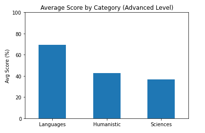

# Polish Matura Exam Numbers Visualized
* Created an interactive bar chart displaying exam results using **Plotly** and **Dash**, with option to choose exam's level and year.
* Created an interactive Map of Poland with Exam Passing Rate in each region. Also, with option to change year and students' gender.
* Cleaned, Translated and Analyzed datasets from [Polish Statistic's Office](https://stat.gov.pl/obszary-tematyczne/edukacja/) about 'Matura' results over years.


# Code and Resources Used
* **Python Version**: 3.9
* **Packages**: pandas, numpy, matplotlib, plotly, Dash, json, itranslate
* * **For Requirements:** ```pip install -r requirements.txt```
* **Polish Map Geojson**: https://github.com/ppatrzyk/polska-geojson

**Bar Chart Dashboard**


**Map Of Poland Graph Dashboard**


# Data Analysis

Taking into account the fact that there is so much categorical data I figured it would be the most efficient to visualize it on Dashboard.

Despite that fact I could find some insights:

The average results have not changed much over the years. In fact it was stable, with slight downtrend.
It is worth to notice that the gap between Advanced and Basic level increased. In 2015 it was about ~13%, however in 2021 it increased to about 20%!


As there was so many subjects - I grouped them into 'Language', 'Humanistic' and 'Science' categories. I have taken into account only advanced level as there was not many Science subjects on basic level.\
It turns out that students feel significantly more comfortable with languages, than humanistic or science subjects.\
Also, it is notable that the languages with best scores are Slavic, which makes sense as Poland is an Slavic country:)




The required subject that every student must take is: foreign language, mathematics and Polish. Let's explore them.\
Obviously scores on basic level tend to be better. Exploring further the graph on the left - it looks like men scored better in English and slightly better on Mathematics. However women scored much better in Polish exam with about 5% difference.\
On advanced level men kept their position with English, but got outscored in mathematics and Polish.


# Data Cleaning Process
I have deleted the columns that were not useful in anyway. Also, casted the numerical values to float as in dataset it appeared as string.\
After that I have translated the columns and values using lambda functions and **Itranslate** library.\
I have also created the Pass Rating column for each year and region. It was used for the map Graph later on.

